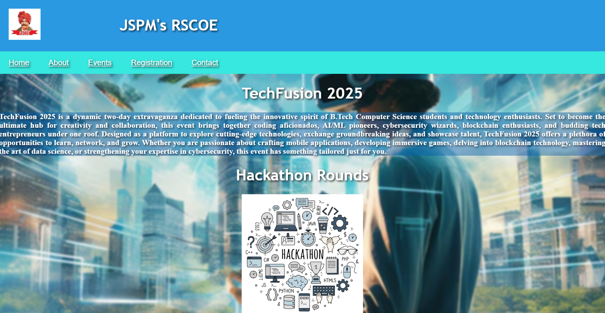
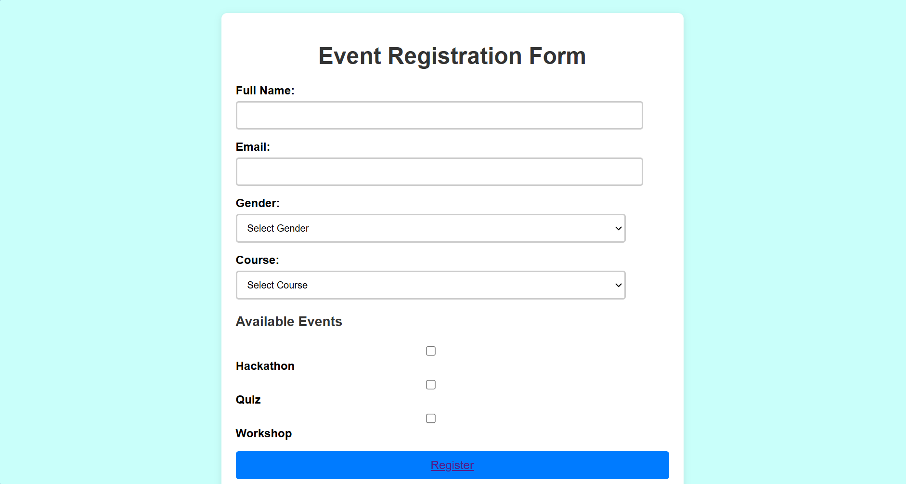

## TechFusion 2025
Welcome to my project on Student Registration for <i>TechFusion 2025</i>, built using <b>HTML, CSS, XML, and JavaScript</b>. This platform is designed to make the registration process for <b> TechFusion 2025 </b>smooth and interactive.

## Description
The platform simplifies student registration by offering an intuitive interface and dynamic functionalities. Users can explore event details, register seamlessly, and receive necessary confirmations.

## Features
- User-Friendly Interface – Simple and responsive design for seamless navigation.

- Registration Form – Allows students to fill in their details and register effortlessly.

- Form Validation – Ensures correct data entry with real-time validation.

- Event Details Page – Provides comprehensive information about TechFusion 2025.

- Confirmation Prompt – Displays a confirmation message upon successful registration.

- Interactive Elements – Enhances user engagement with dynamic JavaScript features.

## Tech Stack
- Frontend: HTML, CSS, JavaScript
- Data Handling: XML (for structured storage of registration details)
## Screenshots

## Remarks
- Requires more additional function and make it more user friendly by adding chatbot
- Details regarding previous event.
